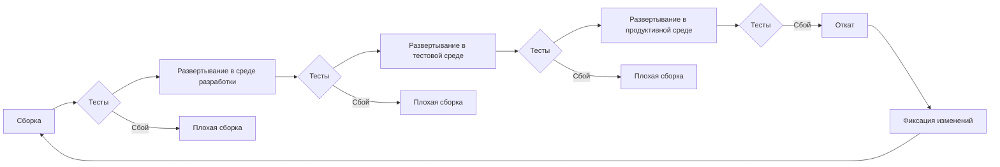
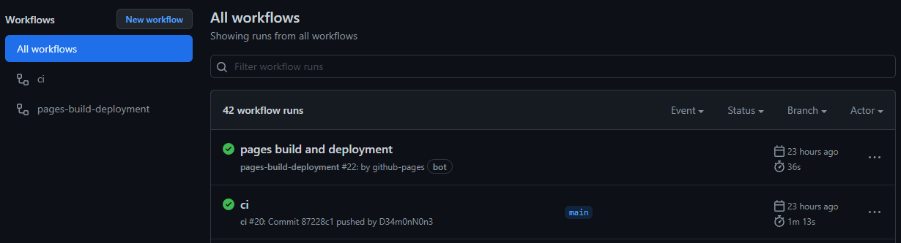
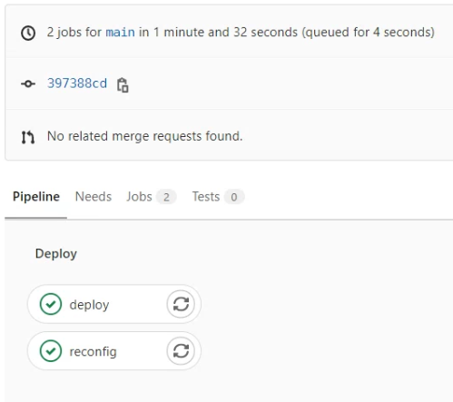

# Методология, политика и стратегия внесения изменений

**Задача:** повышение стабильности

**Вариант 1:**   
Минимизация изменений, имеет эффект накапливания "технического долга" в виде систем и приложений, отчаенно нуждаеушихся в обновлении, которые все боятся касаться, опасаясь что-то сломать.

Особенности:

Системное администрирование и другие эксплутационные роли отделяются от таких областей, как разработка и управления проектами.

* Разработчики продвигают продукт с новыми функциями и улучшениями.

* Эксплутационная группа обеспечивает непрерывное управление производственной средой.

**Вариант 2:**   
Управление изменениями, это частое внесение изменений пока результат не будет соответствовать ожиданиям.
Объединение разработчиков (программистов, аналитиков, владельцев приложения, менеджеров проекта) со специалистами службы эксплуатации (администраторами: безопасности, сетевыми, системными, баз данных и т.д.).

Особенности:

* Разработчики (Dev), специалисты службы эксплуатации (Ops) работают непрерывно. Несут равную ответственность за всю систему.

* Ни одно приложение или служба не должны выпускаться без тестирования.

* Все производственные среды зеркально отражаются в одинаковых средах разработки и тестирования.

* Члены команды Dev и Ops должны находится в непрерывном общении, как стратегических, так и эксплуатационных вопросов.

## Контроль версий

Контроль версий, также известный как управление исходным кодом, — это практика отслеживания изменений программного кода и управления ими. [Системы контроля версий](https://ru.wikipedia.org/wiki/%D0%A1%D0%B8%D1%81%D1%82%D0%B5%D0%BC%D0%B0_%D1%83%D0%BF%D1%80%D0%B0%D0%B2%D0%BB%D0%B5%D0%BD%D0%B8%D1%8F_%D0%B2%D0%B5%D1%80%D1%81%D0%B8%D1%8F%D0%BC%D0%B8) — это программные инструменты, помогающие командам разработчиков управлять изменениями в исходном коде с течением времени. Программное обеспечение контроля версий отслеживает все вносимые в код изменения в специальной базе данных. При обнаружении ошибки разработчики могут вернуться назад и выполнить сравнение с более ранними версиями кода для исправления ошибок, сводя к минимуму проблемы для всех участников команды. Наибольшее распространение сейчас получил протокол `git`, одним из продуктов реализующих его является GitLab.

## Управление конфигурацией

Управление конфигурацией — это процесс учета изменений, вносимых в систему с целью сохранения ее целостности. Обычно используются инструменты и методы, способствующие автоматизации процесса и наблюдению состояния системы.

Преимущества управления конфигурацией серверов состоят в способности определять вашу инфраструктуру как код. Это позволяет:

* Использовать систему контроля версий для отслеживания любых изменений инфраструктуры;

* Повторно использовать скрипты конфигурирования для нескольких серверных сред, например для разработки, тестирования и производства;

* Упрощать процесс дублирования серверов для ускорения восстановления в случае сбоя системы.

Ansible — система управления конфигурациями, написанная на языке программирования Python, с использованием декларативного языка разметки для описания конфигураций. Используется для автоматизации настройки и развертывания программного обеспечения. Наряду с Chef, Puppet и SaltStack считается одной из наиболее популярных систем управления конфигурациями для Linux. Главное отличие Ansible от аналогов — не нужна установка агента/клиента на целевые системы.

Пользователь Ansible создаёт определённые «плейбуки» (англ. playbook, play — игра, пьеса, book — книга) в формате YAML с описанием требуемых состояний управляемой системы. «Плейбук» — это описание состояния ресурсов системы, в котором она должна находиться в конкретный момент времени, включая установленные пакеты, запущенные службы, созданные файлы и многое другое.

Пример установки и запуска службы Web сервера Nginx:

!!! example "setup_nginx.yml"
    ``` yaml
    ---
    - name: Установка Nginx
      package:
        name: nginx
        state: present
    
    - name: Активация и затуск службы Nginx
      systemd:
        name: nginx
        state: started
        enabled: yes
        masked: no
    ```

## DevOps

Это CLAMS (Culture - Культура, Lean - Рациональность, Automations - Автоматизация, Measurement - Измерение, Sharing - Совместная работа)

* Культура: Все работают вместе, чтобы поддерживать общий бизнес-драйвер (цель, продукт) на всех этапах его жизненного цикла.

* Рациональность: Связь в реальном времени, и сосредоточенность на проблемах.

* Автоматизация: Два основных аспекта
  а.  если задача выполняется более двух раз, ее следует автоматизировать;
  б.  не автоматизируй то, чего не понимаешь.

* Измерение: Сбор метрик из сред окружения, для анализа аномалий и определения их причин. Метрики доступны и признаются все причастными.

* Совместная работа: Участие во всех процессах жизненного цикла проекта.

### Стратегия автоматизации

Элементы стратегии:

* Автоматическая настройка новых узлов: установка и настройка ОС и всего необходимого ПО;

* Автоматическое управление конфигурацией: конфигурация должна храниться в одной базе и применяться ко всем узлам одного типа;

* Автоматическое продвижение кода: распространение нового функционала из среды разработки в тестовую среду и из тестовой в продуктивную. Тестирование автоматизированно;

* Систематическое обновление и исправление существующих узлов.

### Основные концепции

* Непрерывная интеграция (CI) - процесс совместной работы с общей кодовой базой, автоматизированного слияния разрозненных изменений в единую сборку в системе контроля версий, и ее тестированием. Результатом является получение "артефакта", упакованного программного обеспечения.

* Непрерывная доставка (CD) - процесс автоматизированного развертывания сборок в средах после завершения непрерывной интеграции. В результате происходит установка "артефакта" в серверную среду.

### Конвейеры (Pipelines)

Конвейер CI/CD представляет собой последовательность шагов, называемых этапами. Каждый этап - это по существу сценарий, выполняющий задачи, специфичные для ПО.

Диаграмма конвейера CI/CD:



Расмотрим два конвейера (Pipeline), для сборки статического сайта на примере mkdocs в GitHub и GitLab. Оба конвейера описываются в формате YAML манифестов с заранее определенным именем и расположением. У каждой системы CI/CD будет своя структура и синтаксис. В данных примерах не расматривается создание сценариев тестирования, так как результатом процессов являются статические данные.

!!! info "Для информации"
    Описанное ниже является эквивалентом следующих операций:   
    * Скопировать проект. Команда: `git clone <url_project>`   
    * Собрать статический сайт. Команда: `mkdocs build -c -f texdocs.yml -d "/var/www/base/docs/<site_name>"`   
    * Перезапустить сервис. Команда: `systemctl restart nginx.service`   

#### GitHub

Манифест располагается в внутри проекта по пути `.github/workflows/ci.yml`.

!!! example "ci.yml"
    ``` yaml
    name: ci # Задает имя конвейера
    on: # Задает когда необходимо запускать интеграцию, в данном примере сразу после внесения изменений в проект.
      push:
        branches: [ main ]
      pull_request:
        branches: [ main ]
    jobs: # Содержит список задач.
      deploy: # Имя сценария задач. В процессе выполнения происходит создание структуры статического сайта со всеми страницами, и публикацией его в отдельной ветке проекта.
        runs-on: ubuntu-latest # Выбираем среду для сборки, в данном случае используем docker контейнер.
        strategy:
          matrix:
            python-version: [ 3.8 ]
        if: github.event.repository.fork == false
        steps:
          - uses: actions/checkout@v2
          - name: Set up Python ${{ matrix.python-version }}
            uses: actions/setup-python@v2
            with:
              python-version: ${{ matrix.python-version }}
              architecture: x64
          - name: Install upgrade pip
            run: python3 -m pip install --upgrade pip # Обновления пакетов python перед установкой зависимостей и сборкой статического сайта.
          - name: Install Python dependencies
            run: python3 -m pip install . # Запускается скрипт `setup.py` для установки зависимостей.
          - run: python3 -m mkdocs gh-deploy --force # Запускает скрипт сборки статического сайта и копирования его в отдельную ветку проекта.
    ```

!!! example "setup.py"
    ``` python
    import json
    from setuptools import setup, find_packages
    
    # Load list of dependencies
    with open("requirements.txt") as data:
        install_requires = [
            line for line in data.read().split("\n")
            if line and not line.startswith("#")
        ]
    
    # Package description
    setup(
        install_requires = install_requires,
    )
    ```

Работа конвейера:


Выше описан процесс интеграции, для процесса доставки используется функция GitHub Pages, которая просто использует ранее подготовленный сайт для подключения как виртуальный Web сервер.

#### GitLab

Манифест располагается в файле внутри проекта `.gitlab-ci.yml`.

!!! example "gitlab-ci.yml"
    ``` yaml
    stages: # Задает имя конвейера
      - deploy
    
    deploy: # Задает имя списка задач.
      stage: deploy
      only: # Задает когда выполнять задачи, в данном примете сразу после внесения изменений в ветки проекта с названием main  или master.
        - main
        - master
        - merge_requests
      tags:
        - mkdocs # Определяет где будут запущенны сценарии.
      before_script:
        - if [ ! -d $CI_PROJECT_DIR/docs/assets ];  then ln -s /var/mkdocs/templates/docs/assets/ $CI_PROJECT_DIR/docs/; fi
        - if [ ! -d $CI_PROJECT_DIR/material ];  then ln -s /var/mkdocs/templates/material/ $CI_PROJECT_DIR/; fi
        - VIRT_SITE_NAME=$(cat texdocs.yml | python /usr/local/lib/python3.6/site-packages/shyaml.py get-value site_description)
      script:
        - cd $CI_PROJECT_DIR && sudo -u mkdocs /var/mkdocs/.local/bin/mkdocs build -c -f texdocs.yml -d "/var/www/base/docs/$VIRT_SITE_NAME" # Запускает скрипт сборки статического сайта и копирования его в директорию с остальными сайтами на сервере.
    
    reconfig: # Задает имя списка задач.
      stage: deploy
      only: # Задает когда выполнять задачи, в данном примете сразу после внесения изменений в ветки проекта с названием main  или master.
        - main
        - master
        - merge_requests
      tags:
        - mkdocs # Определяет где будут запущенны сценарии.
      script:
        - sudo ansible-playbook /var/mkdocs/new_docs/playbook.yml # Запускает сценарий обновления конфигурации Web сервера, после добавления нового сайта.
    ```

Работа конвейера:


В данном случае процесс интеграции происходит на целевом сервере, а интеграцию берет на себя специальный агент [GitLab Runner](https://docs.gitlab.com/runner/) запушенный на нем.

Конфиг фаил для GitLab Runner расположен в `/etc/gitlab-runner/config.toml`.

!!! example "config.toml"
    ``` toml
    concurrent = 1
    check_interval = 0
    
    [session_server]
      session_timeout = 1800
    
    [[runners]]
      name = "documentation_ci" # Описание. Только для информации.
      url = "http://.../" # URL-адрес экземпляра GitLab.
      token = "..." # Токен аутентификации, который получается во время регистрации.
      executor = "shell" # Способ выполнения сценариев.
      builds_dir = "/var/mkdocs/"
      [runners.custom_build_dir]
      [runners.cache]
        [runners.cache.s3]
        [runners.cache.gcs]
        [runners.cache.azure]
    ```

### Автоматические тесты

Автоматические тесты - инструмент снижения издержек. Автотесты принято делить на три типа: модульные (юнит), сервисные и интеграционные (UI, браузерные, end‑to‑end, E2E) тесты.

* Модульные тесты - проверяют работу отдельно взятых модулей — функций, классов, моделей, контроллеров — кирпичиков, из которых построено приложение. Модульные тесты выполняют проверки за миллисекунды, потому что тестируют модуль в отрыве от остального приложения.

* Интеграционные тесты - проверяют приложение целиком, когда все модули в сборе. Их задача — убедиться, что модули правильно соединены друг с другом. Кроме того, ими проверяют те части приложения, которые не имеют права сломаться: биллинг, регистрацию, оформление заказа. Интеграционные тесты длятся секунды, а иногда и минуты: запускаем приложение, загружаем его в браузер или эмулятор и «прокликиваем» сценарии.

* Сервисные тесты — среднее между интеграционными и модульными. Их задача — проверить функционал, который нельзя уверенно протестировать модульными тестами, а интеграционными тестировать «слишком жирно».

Отдельно существует статический анализ кода. **Статический анализ кода** - анализ программного обеспечения, производимый без реального выполнения исследуемых программ. Он проводится с целью проверки синтаксиса и обнаружения потенциально ненадежных частей кода (небезопасных функций или уязвимых библиотек).


!!! example "Пример статического анализа сценариев Ansible"

    === "GitHub"
    
        ```ymal
        name: ansible-lint
        
        on: [push]
        
        jobs:
          build:
            runs-on: ubuntu-latest
            name: ansible-lint
            steps:
              - uses: actions/checkout@master
              - uses: actions/setup-python@v2
              - run: pip install ansible ansible-lint
              - run: ansible-lint --version
              - run: ansible-lint .
        ```
    
    === "GitLab"
    
        ```ymal
        image: python:3-slim
        
        before_script:
          - pip install ansible ansible-lint
          - ansible-lint --version
        
        stages:
          - ansible-lint
        
        ansible-lint:
          stage: ansible-lint
          script:
            - ansible-lint .
        ```

###


### Безопасность

Так как распределение процессов происходит централизованно из одной точки на основе маркеров. То необходимо предварительно настроить ограничения на всех узлах. К примеру, в разработке может происходить очистка всей среда вовремя сборки, что может привести к удалению данных в продуктивной среде по не осторожности. Или удалению данных в другом проекте, из-за указания неверного маркера. Для избежания подобных проблем настроить разрешение только необходимых операций в рамках конкретного проекта и среды.

## Итог

Для управления жизненным циклом продуктов с использованием непрерывной интеграции и доставки, необходимо создание регламентов и процессов постоянного вынесения изменения в программный код. Написание сценариев всех операций от развертыванию и подготовки сред, до сборки и установки программного кода.
